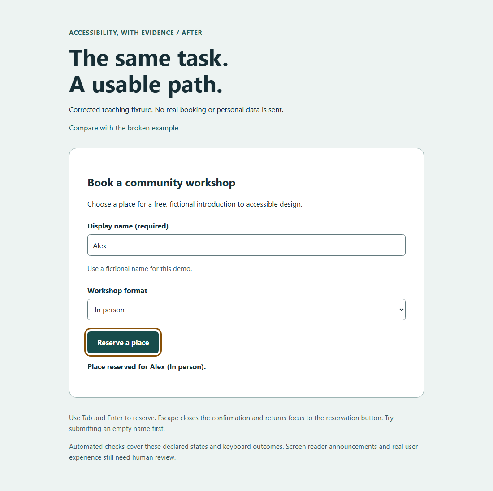

# Accessibility, with evidence

**Help coding agents fix accessibility barriers in source code, verify their changes, and show what still needs human review.**

An open-source skill and toolkit for websites and web applications. Designed for maintainers who need useful fixes with reproducible evidence.

[Use the skill](SKILL.md) · [Try the demo](demo/README.md) · [See the evidence](docs/EVIDENCE.md) · [Judge walkthrough](docs/JUDGE-WALKTHROUGH.md) · [Contribute](CONTRIBUTING.md)

## From a barrier to a verified change

1. **Define the scope:** freeze pages, roles, data and interactive states.
2. **Fix the source:** use axe-core and Playwright to find issues, then preserve functionality while correcting them.
3. **Challenge the result:** a separate reviewer replays the same scenarios and checks complete user tasks.
4. **Publish the evidence:** retain the patch, reports, scope identity, unresolved findings and human checks.

The toolkit rejects contradictory agent reports. A missing page, failed build or unresolved final finding cannot become a successful result merely because an agent says “PASS”.

| Problem | Toolkit response |
| --- | --- |
| Dialogs and authenticated screens are missed | Explicit states, routes and browser storage state |
| A smaller scope looks like an improved score | Scenario identities and state-definition hashes |
| The corrector judges its own work | Independent verification and final evaluation |
| A test clicks without checking the result | Assertions about exact names, visibility and outcomes |
| Failed experiments disappear | Explicit failure, incomplete and budget outcomes |

**The technical target is WCAG 2.2 A/AA for web content.** Zero automated violations does not establish complete WCAG or RGAA conformance. Native software, documents, assistive-technology compatibility and legal applicability need additional methods and evidence. [W3C evaluation guidance](https://www.w3.org/WAI/test-evaluate/tools/selecting/).

## Start locally

Requirements: **Node.js 22+**, **Python 3.10+**, **pnpm 10.34.5**. Direct and transitive tool dependencies are locked.

```sh
git clone https://github.com/titoude/accessibilite-conformite.git
cd accessibilite-conformite
pnpm install --frozen-lockfile --ignore-scripts
pnpm exec playwright install chromium
pnpm test
```

On Linux, use `pnpm exec playwright install --with-deps chromium` if browser system dependencies are missing.

With your application running, execute from this toolkit directory:

```sh
node audit.mjs http://localhost:3000 --states none --out a11y-audit/baseline
```

Use `--states none` only when the declared scope has no dynamic states. Otherwise configure `STATES` in your application-specific runner copy, freeze it before the baseline, and run with `--states all`:

```js
const STATES = {
  'settings-dialog': {
    url: origin => origin + '/settings',
    setup: async page => {
      await page.getByRole('button', { name: 'Open settings' }).click();
      await page.getByRole('dialog', { name: 'Settings' }).waitFor();
    },
  },
};
```

Useful options: `--urls /,/contact` for explicit routes, `--storage-state auth.json` for authorized authenticated sessions, `--keep-hash` for hash routes, and `--strict-incomplete` to block unresolved axe findings. Keep authentication files private.

| Exit | Meaning |
| --- | --- |
| `0` | Requested scenarios scanned without automated violations or execution errors; review incompletes and human checks |
| `1` | Automated violations found |
| `2` | Invalid configuration, navigation/execution error, or strict incomplete findings |

Reports: `report.md`, `report.json`, `scope.json`. Configuration failures replace old evidence with a fresh error report.

## Try a two-minute demonstration

`pnpm demo` serves a local [before/after workshop form](demo/README.md). Follow the keyboard walkthrough: submit an empty field, select a format, confirm the reservation, and dismiss the dialog with focus restored. No real booking is made.

`pnpm test:demo` replays the task and preserves full reports and screenshots. On the current local run, the broken initial page has three axe rule violations; the corrected initial, error, dialog and confirmation states have zero violations and zero incomplete findings. This is a hand-authored teaching example, not a measured AI-remediation result.

<details>
<summary>See the corrected example after a keyboard reservation</summary>



</details>

## Give the skill to an agent

Use [SKILL.md](SKILL.md) with its runner, assertion helpers and [review checklist](checklist.md). The skill is agent-agnostic; the optional Python orchestration adapters require Devin's workflow runtime.

> Apply this accessibility skill to our web application. Freeze the scope first, preserve all features, produce source fixes and reproducible evidence, and list every unverified criterion and assistive-technology check.

The CLI scans the application. A coding agent or developer produces source fixes. This repository does not provide a standalone AI service or promise model-independent results.

## Results and limits

The historical V2 report records **six projects with reproducible zero-violation axe results**, including **three within the three-round budget**. These are historical scanner results, not six fully conformant products or a controlled measurement of the skill's benefit. Some patches needed later fixes.

The [paired Whoogle pilot](benchmarks/paired-pilot/RESULTS.md) gives one isolated agent the skill and another the same task without it. A separate [reviewer replay](benchmarks/paired-pilot/independent-review/README.md) reproduced every violation-node identity and held-out status on fresh application clones.

| Same frozen application and evaluation scope | Baseline | Without skill | With skill |
| --- | ---: | ---: | ---: |
| Detected axe violation nodes | 108 | 1 | 1 |
| Product checks: PASS / FAIL / NOT_TESTED | 4 / 6 / 3 | 9 / 1 / 3 | 9 / 1 / 3 |
| Instrumentation controls passed | 5 / 5 | 5 / 5 | 5 / 5 |

**This pilot does not demonstrate an advantage for the skill.** Both patches retain the same contrast finding and fail the focus-indicator check. Three product checks remain untested. The with-skill agent reported zero violations; independent replay found one. Keeping that discrepancy visible is part of the product's verification contract.

A separate [W3C ACT calibration](benchmarks/paired-pilot/RESULTS.md) compares selected scanner rules with recognized reference cases. It evaluates the scanner, not agent effectiveness or complete WCAG coverage. [Methods, raw evidence and limitations](docs/EVIDENCE.md).

The [TodoMVC task pilot](benchmarks/task-pilot/README.md) tests three complete
keyboard journeys on a pinned offline application. The baseline passes one.
The control passes all three on its first submission; the skill arm passes
two, then all three after a correction. [Independent replay](benchmarks/task-pilot/independent-review/README.md)
reproduces every task and step status. Both final patches retain axe findings
and unresolved human checks. These two exploratory pairs use different targets
and skill versions; neither establishes a general advantage or robustness on
weaker models.

| Resource | Purpose |
| --- | --- |
| [audit.mjs](audit.mjs) | Scanner and scope reports |
| [tests/](tests/) | Decision and browser regression tests |
| [tests-validateurs/](tests-validateurs/) | Deliberately broken cases and assertion helpers |
| [Paired pilot and calibration](benchmarks/paired-pilot/README.md) | Frozen prompts, source patches, reference fixtures and measured outcomes |
| [Keyboard-task pilot](benchmarks/task-pilot/README.md) | TodoMVC journeys, isolated agents, failed submissions and independent replay |
| [Criterion coverage record](templates/README.md) | All 55 WCAG 2.2 A/AA criteria, initially untested |
| [workflow.py](workflow.py) | Optional Devin orchestration |
| [benchmark-v3.py](benchmark-v3.py) | Benchmark adapter and hardened metadata checks |
| [benchmark-v2/](benchmark-v2/) | Preserved historical patches and reports |
| [BENCHMARK-PLAN.md](BENCHMARK-PLAN.md) | Historical methodology and proposed corpus |

Historical French audit documents remain as provenance. Use the current skill and release checklist for new work.

## Opethon and disclosure

The theme fits Accessibility & Inclusion. **The existing repository needs an organizer ruling before it can be presented as eligible.** As checked on 28 September 2026, [Opethon](https://opethon.com/) requires a new public repository created after its start date and lists October or November, with exact dates still pending. [GitHub records this repository's creation](https://api.github.com/repos/titoude/accessibilite-conformite) on 27 September 2026. It therefore predates the announced event window; the displayed rule is not satisfied by the existing repository. Preserve the history and obtain written clarification or an exception.

Developed with AI assistance, including Devin and Codex. Human assistive-technology validation has not yet been completed for the published benchmark corpus.

MIT licensed. Upstream benchmark materials retain their own licenses; see [third-party notices](THIRD-PARTY-NOTICES.md).
